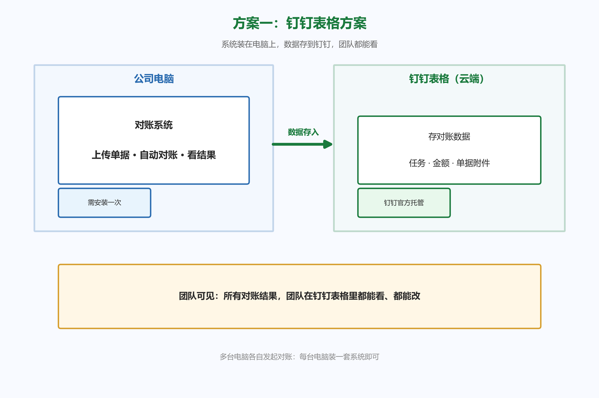
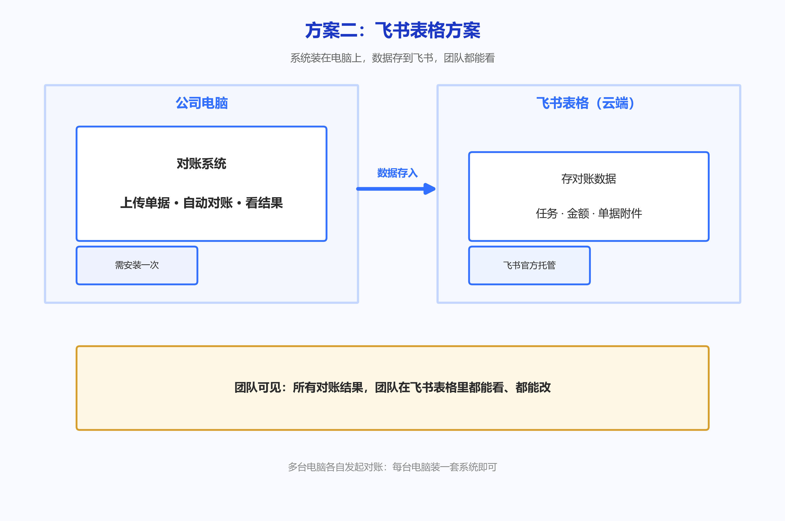
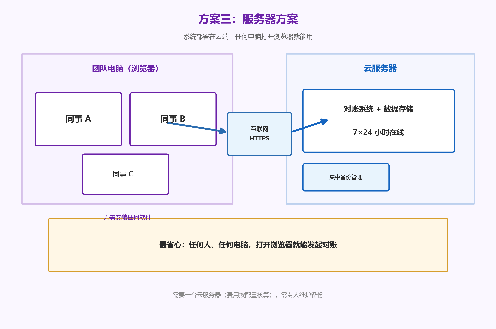

# 对账系统解决方案

> 版本：v4.0
> 日期：2026-08-18

---

## 一图看懂三种方案

我们提供三种部署方式，核心区别就一张表：

| 对比项 | 方案一：钉钉表格 | 方案二：飞书表格 | 方案三：服务器 |
|--------|:---:|:---:|:---:|
| **一句话** | 装在电脑上，数据存钉钉 | 装在电脑上，数据存飞书 | 部署云端，浏览器访问 |
| **需要装软件吗** | 装在一台电脑 | 装在一台电脑 | 不用装，浏览器就能用 |
| **数据存在哪** | 钉钉表格（云端） | 飞书表格（云端） | 云服务器 |
| **多人查看/操作数据** | ✅ 团队在钉钉都能看 | ✅ 团队在飞书都能看 | ✅ 浏览器都能看 |
| **多台电脑各自发起对账** | ⚠️ 每台都需装系统 | ⚠️ 每台都需装系统 | ✅ 任何电脑浏览器即可 |
| **电脑坏了影响** | 数据不丢，但要重装才能用 | 数据不丢，但要重装才能用 | 换台电脑登录就能用 |
| **需要买服务器** | 否 | 否 | 是（按配置核算） |
| **需要专人维护** | 基本不用 | 基本不用 | 需要有人维护备份 |
| **对账量上限** | 较低（免费额度有限） | 较高（额度充裕） | 几乎无上限 |
| **统计报表能力** | 基础 | 强（自动算差额、汇总） | 强 |
| **适合规模** | 小 | 中 | 中大型 |
| **需要联网** | 是 | 是 | 是 |

---

## 三张架构图

### 方案一：钉钉表格方案

系统装在一台电脑上，对账数据自动存到钉钉表格。**所有对账结果团队在钉钉表格里都能看到，多人可同时操作表格**；如需多台电脑各自发起对账，每台电脑装一套系统即可。

### 方案二：飞书表格方案

和方案一基本相同，数据存到飞书表格。飞书表格的**统计能力更强**，可自动算差额、汇总报表。同样，**团队都能看表格、改数据**；如需多台电脑各自发起对账，每台电脑装一套系统即可。

### 方案三：服务器方案

系统部署在云服务器，**任何人、任何电脑，打开浏览器就能发起对账**。数据集中存储，统一备份维护。适合多人使用、需要集中管控的团队。

---

## 三种方案怎么选

| 您的情况 | 建议方案 |
|---------|---------|
| 公司用**钉钉**，对账量不大，单点使用 | **方案一：钉钉** |
| 公司用**飞书**，需要好报表，对账量中等 | **方案二：飞书** |
| **多人各自要发起对账**（比如财务、销售在不同城市） | **方案三：服务器**（免安装，最省心）；或方案一/二每台电脑装系统 |
| 有 IT 人员，能承担服务器费用，要长期稳定 | **方案三：服务器** |
| 想**不买服务器**、单点对账、最快上线 | **方案一或二** |

---

## 费用说明

系统的实施和功能费用统一由我们（Cherry）报价。这里单独说清楚**钉钉/飞书平台自身的费用**，避免后续产生额外支出：

| 平台 | 免费额度 | 超出后怎么办 |
|------|---------|-------------|
| **钉钉多维表格** | 标准版每月约 **5000 次** API 调用 | 超出后需购买「企业应用开发增购包」（约 **19800 元/年**）或升级企业版 |
| **飞书多维表格** | 免费版每月约 **100 万次** API 调用（限时活动） | 商业版/企业版**无调用次数限制**，免费版额度远超日常使用 |

### 实际用量估算

| 场景 | 每月对账量 | 预计 API 消耗 | 钉钉够用吗 | 飞书够用吗 |
|------|-----------|--------------|-----------|-----------|
| 小型 | 30 个任务 | 约 450 次 | ✅ 够 | ✅ 够 |
| 中型 | 100 个任务 | 约 1500 次 | ✅ 够 | ✅ 够 |
| 大型 | 300 个任务 | 约 4500 次 | ⚠️ 接近上限 | ✅ 够 |
| 超大型 | 500+ 个任务 | 约 7500 次 | ❌ 需付费升级 | ✅ 够 |

**一句话总结：**
- **钉钉**：日常几十到一两百个任务，免费额度够用；量大（每月 300+）才需要付费。
- **飞书**：免费额度非常充裕，基本不用担心超量。

> 系统本身的实施、部署、维护费用由我们统一报价，与上述平台费用无关。

---

## 常见问题

**Q1：电脑坏了，数据会丢吗？**
- 三种方案数据都存在云端/服务器，**都不会丢**。
- 方案一/二：换电脑重装系统后继续用。
- 方案三：换台电脑浏览器登录就能用。

**Q2：团队成员都要自己发起对账，可以吗？**
- 方案一/二：**可以，但每台电脑都要装一套系统**。装好后各台电脑都能各自发起对账；装系统这台以外的人，如果没装，只能在钉钉/飞书表格里看数据、改数据。
- 方案三：**最省心**。任何人在任何电脑上打开浏览器就能发起对账，无需安装。

**Q3：多人能同时操作同一个表格吗？**
- 方案一/二：**可以**。钉钉/飞书表格本身是云端协作工具，团队多人可同时查看、编辑。
- 方案三：**可以**。浏览器多人同时访问。

**Q4：对账任务多了，会不会不够用？**
- 方案一：钉钉免费额度较低，任务多了可能需付费升级。
- 方案二：飞书免费额度很充裕，一般不用担心。
- 方案三：几乎无上限，数据量再大也撑得住。

**Q5：需要专人维护吗？**
- 方案一/二：基本不用，装好就能用。
- 方案三：需要有人负责服务器日常维护和备份。

**Q6：没有网能用吗？**
- 三种方案都需要联网（数据都存在云端/服务器）。

---

*如有任何疑问，欢迎随时沟通*
