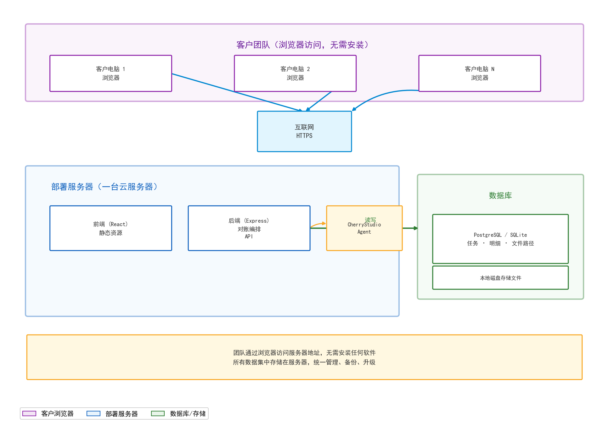

# 锐力对账系统 · 方案三：服务器部署方案

> 版本：v1.0
> 日期：2026-08-18
> 状态：待评审

---

## 1. 方案概述

**一套系统部署在云端服务器上，客户团队通过浏览器访问，无需在个人电脑上安装任何软件。**

数据集中存储在服务器，统一管理、备份和升级。系统部署在阿里云/腾讯云等云服务器上，客户团队通过浏览器访问服务器地址即可使用。

---

## 2. 目标架构



### 2.1 组件清单

| 组件 | 说明 |
|------|------|
| 前端 (React) | 上传文件、展示对账结果，静态资源部署在服务器 |
| 后端 (Express) | 处理上传、编排对账、读写数据库 |
| CherryStudio Agent | 识别文件、计算差异、返回 JSON |
| 数据库 | PostgreSQL / SQLite，存储任务、明细、文件路径 |
| 本地磁盘 | 服务器磁盘存储原始对账文件 |
| 浏览器 | 客户团队通过浏览器访问，无需安装 |

---

## 3. 数据存储

| 数据 | 存储位置 |
|------|---------|
| 对账任务记录 | 服务器数据库 |
| 审核明细 | 服务器数据库 |
| 原始文件 | 服务器本地磁盘 |
| 对账结果 | 服务器数据库 |

---

## 4. 对账流程

```
① 客户通过浏览器上传结算单 + ERP 文件
② 后端保存文件到服务器磁盘
③ 调用 CherryStudio Agent 对账
④ Agent 识别文件、计算 difference
⑤ 后端校验结果，写入数据库
⑥ 前端展示对账结果（浏览器访问）
```

---

## 5. 优势

| 优势 | 说明 |
|------|------|
| **零安装** | 客户团队无需安装任何软件，浏览器访问即可 |
| **集中管理** | 数据统一存储在服务器，便于备份、升级、维护 |
| **多人协作** | 多个团队成员可同时通过浏览器使用 |
| **跨平台** | 不依赖操作系统，Windows / macOS / Linux 均可访问 |
| **数据安全** | 服务器集中管控，可配置 HTTPS 加密、权限管理 |
| **实时更新** | 系统升级后所有用户立即生效，无需逐个更新 |
| **不受本地环境影响** | 不依赖个人电脑的 SSH、OpenSSH 等环境配置 |

---

## 6. 劣势

| 劣势 | 说明 |
|------|------|
| **需要服务器** | 需要一台云服务器（阿里云/腾讯云等），产生年费 |
| **需要公网** | 服务器需要公网 IP 或域名，客户需能访问 |
| **依赖网络** | 客户需要稳定的网络连接访问服务器 |
| **运维成本** | 需要有人负责服务器运维、安全补丁、备份 |
| **部署成本** | 需要配置 HTTPS、域名、防火墙等 |

---

## 7. 服务器成本估算

| 项目 | 费用 |
|------|------|
| 云服务器（2核4G） | 约 300-600 元/年（新用户优惠） |
| 域名 | 约 50 元/年 |
| HTTPS 证书 | 免费（Let's Encrypt） |
| 数据库 | 可部署在服务器本机（免费） |
| **合计** | **约 400-700 元/年** |

---

## 8. 适用场景

- 客户团队**多人使用**，需要同时访问
- 客户有**固定 IT 人员**可以维护服务器
- 客户**网络稳定**，可访问公网
- 对**数据集中管控**有要求

---

## 9. 部署流程

```
① 购买云服务器（阿里云/腾讯云 2核4G）
② 安装 Node.js 22+
③ 上传系统代码
④ 配置 HTTPS 证书 + 域名
⑤ 启动前后端服务
⑥ 配置 CherryStudio Agent
⑦ 上线，客户浏览器访问
```

---

*文档结束*
