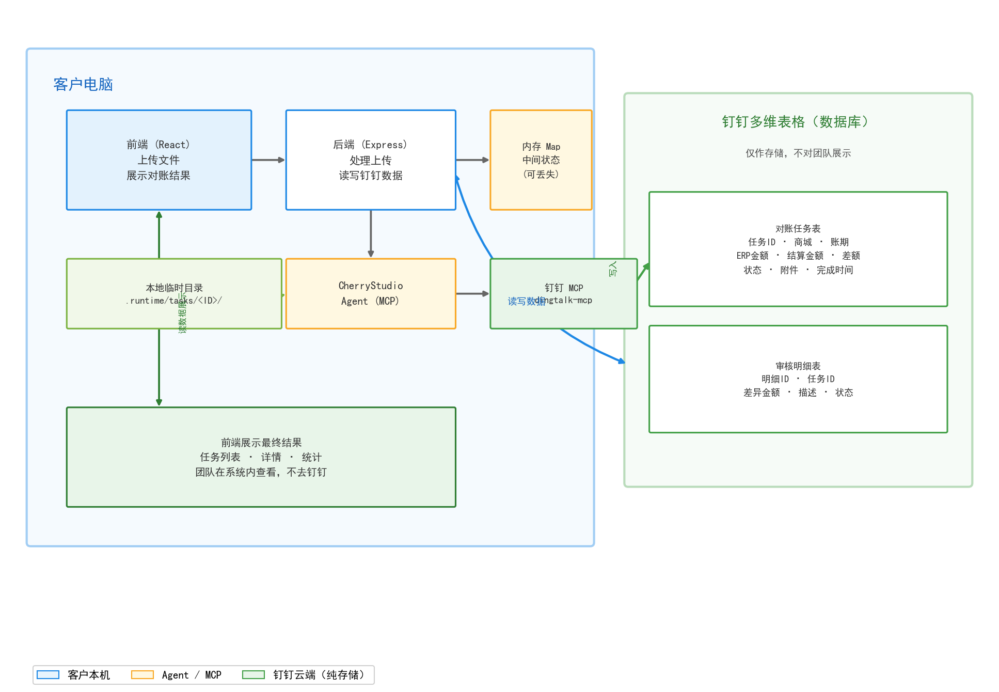

# 锐力对账系统 · 方案一：钉钉多维表格方案

> 版本：v1.0
> 日期：2026-08-18
> 状态：待评审

---

## 1. 方案概述

**一套本地部署的对账系统，使用钉钉多维表格作为数据存储。**

系统部署在客户电脑上，前端展示对账结果。对账数据统一存储在钉钉多维表格中，无需自建数据库服务器。钉钉多维表格由钉钉官方托管，数据安全可靠。

---

## 2. 目标架构



### 2.1 组件清单

| 组件 | 说明 |
|------|------|
| 前端 (React) | 上传文件、展示对账结果 |
| 后端 (Express) | 处理上传、编排对账、读写钉钉数据 |
| CherryStudio Agent | 识别文件、计算差异、返回 JSON |
| 钉钉 MCP | Agent 操作钉钉多维表格的工具层 |
| 钉钉多维表格 | 数据存储（钉钉官方托管） |
| 内存 Map | 对账中间状态缓存 |

---

## 3. 数据存储

| 数据 | 存储位置 |
|------|---------|
| 对账任务记录 | 钉钉多维表格 |
| 审核明细 | 钉钉多维表格 |
| 原始文件 | 钉钉多维表格附件字段 |
| 对账结果 | 钉钉多维表格 |

数据存储在钉钉官方托管的云端，无需自建数据库，无需维护服务器。

---

## 4. 对账流程

```
① 用户上传结算单 + ERP 文件
② 后端保存文件到本地临时目录
③ 调用 CherryStudio Agent 对账
④ Agent 识别文件、计算 difference
⑤ 后端校验结果，写入钉钉多维表格
⑥ 前端展示对账结果
```

---

## 5. 优势

| 优势 | 说明 |
|------|------|
| **零运维** | 无需自建数据库服务器，数据存在钉钉官方托管 |
| **无需服务器** | 不依赖自建 PostgreSQL，零服务器成本 |
| **数据安全** | 钉钉官方保障数据存储安全 |
| **实施简单** | 只需在钉钉创建多维表格 + 企业应用 |
| **成本低** | 无服务器费用，钉钉免费额度即可满足日常使用 |
| **本地运行** | 系统运行在客户电脑，数据通过 API 写入钉钉 |

---

## 6. 劣势

| 劣势 | 说明 |
|------|------|
| **API 能力受限** | 钉钉 API 不支持排序、聚合统计，需在代码中自行处理 |
| **额度限制** | 标准版每月 5000 次 API 调用，超出需付费 |
| **依赖网络** | 需要能访问钉钉 API |
| **单机运行** | 系统运行在一台电脑上，多人同时使用需共享访问 |

---

## 7. 适用场景

- 对账量**不大**（每月几十到一百个任务）
- 客户**不想购买服务器**
- 客户公司**使用钉钉**
- 需要**快速上线**、低实施成本

---

## 8. 部署要求

| 项 | 要求 |
|----|------|
| 操作系统 | Windows 或 macOS |
| Node.js | ≥ 22.13 |
| CherryStudio | 企业版已启动 |
| 钉钉 | 已创建多维表格 + 企业内部应用 |
| 网络 | 能访问钉钉 API |

---

*文档结束*
